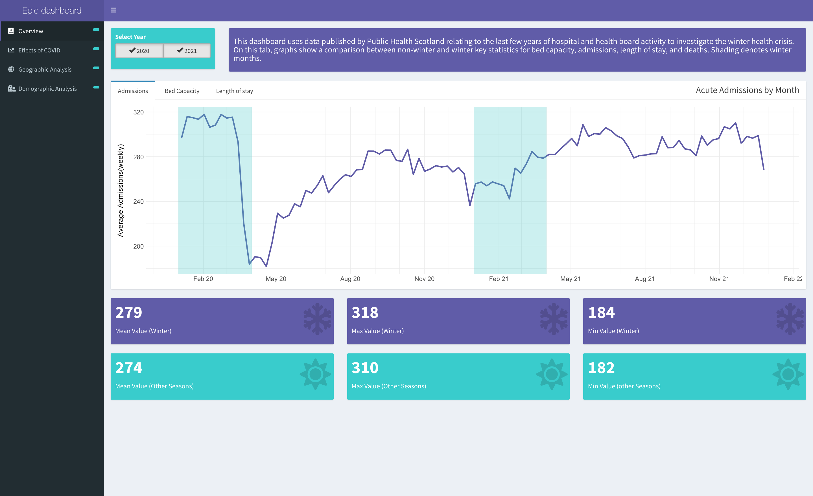
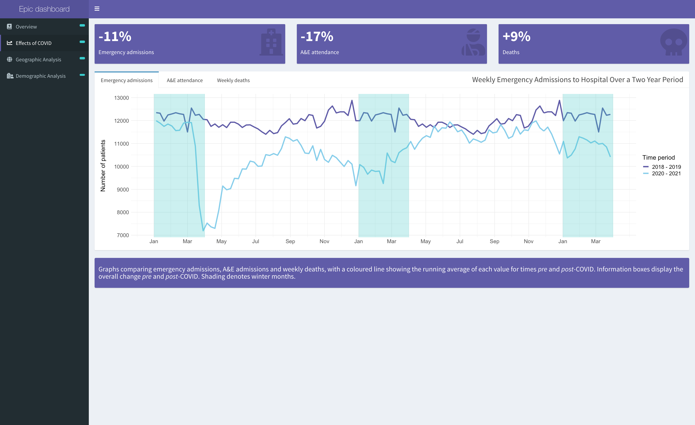
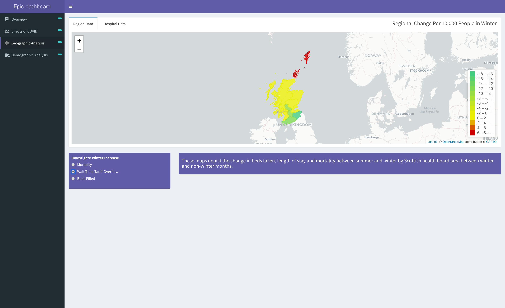
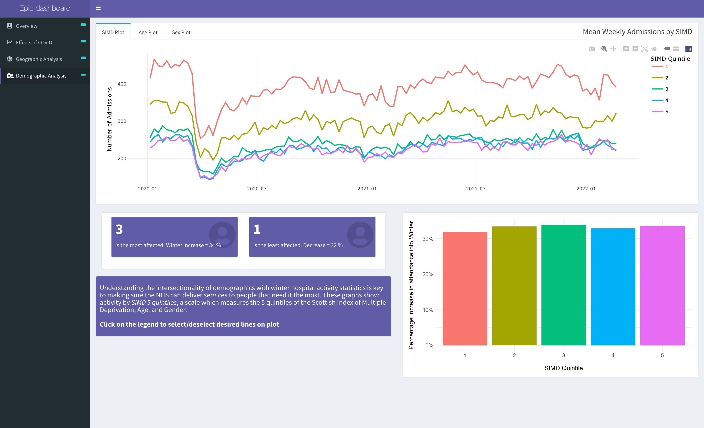

# Dashboard Project - Public Health in Scotland Interactive Dashboard

## Introduction

We were given a brief from PHS to determine whether or not there was a winter crisis in NHS Scotland within the acute care sector over the last four years. This repository contains an RShiny dashboard applicaiton and additional files for testing and exploring the data. The Dashboard allows users to explore data through overview, geographic, temporal demographic tabs which include an array of interactive visualisations.

## Team Members

Our team was made up of four members :

* Michael Kustra
* Marcus Eilertsen
* Oscar "El'Chapo" Chapman
* Tom Keeling

## Process Methodology

  The data was retrieved from Public Health Scotland's open-source datasets. The data was cleaned and wrangled, and four KPI's were drawn out:

* Admittance Rates
* Bed Occupancy
* Wait Time Quota Achievement
* Mortality

  These were then filtered to show various discoveries within each relevant tab.

## Packages Used

### Cleaning and Wrangling

Tidyverse, sf and Lubridate were the primary tools used to sort and explore data.

### Visualisation

Ggplot2, ggplotly and leaflet were all used to show both numerical and spatial data.

### Dashboard Structure

Shiny and Shinydashboard were used to build the bones of the application extensively.

## App Functionality
The app has four tabs which display data on different topics:

* Overview - allow the user to understand the KPI's and extents of the data from the outset.
* Pre/Post Covid - how has the winter crisis persisted throughout covid?
* Geographic - two maps comparing health-board and hospital specific data.
* Demographic - allows the user to filter by SIMD Quintile, age group and gender to assess interssectional inequalities in health data.

## Images
### Overview Tab

### Pre/Post Covid Tab

### Geographic Tab

### Demographic Tab

## References

All data was taken from PHS's open-source hospital datasets :
https://www.opendata.nhs.scot/dataset

